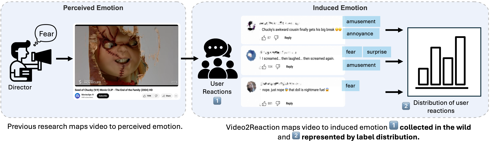

# Video2Reaction: A Benchmark for Predicting Audience Reactions to Video


<div align="center">

[[📖 Paper](#)] [[📊 Dataset (Hugging Face)](https://huggingface.co/datasets/video2reac/Video2Reaction/tree/main)] [[📝 Citation](#citation)]

</div>

> **Note:** the paper link above is a placeholder — it will be filled in once available.

<p align="center">
    
</p>

Video2Reaction is a benchmark for predicting how audiences emotionally react to short video clips, built from movie reaction clips and their YouTube comments. Unlike prior work that maps video to the *perceived* emotion (what emotion the director intended), Video2Reaction maps video to the *induced* emotion — the distribution of reactions actually expressed by viewers in the wild. This repository contains the dataset loader, model architectures, baselines, and preprocessing pipeline used in our work.

## Table of Contents

- [Introduction](#introduction)
- [Dataset](#dataset)
- [Installation](#installation)
- [Quick Start: Loading the Dataset](#quick-start-loading-the-dataset)
- [Data Collection & Preprocessing](#data-collection--preprocessing)
- [Training & Evaluation](#training--evaluation)
- [Repository Structure](#repository-structure)
- [Citation](#citation)
- [License](#license)

## Introduction

Each sample in Video2Reaction pairs a movie clip with a distribution over **21 reaction classes** (e.g. *joy*, *sadness*, *surprise*, *amusement*, *fear*), derived from viewer comments and ordered by valence-arousal (VAD). The benchmark supports:

- **Classical multimodal fusion baselines** combining visual, acoustic, semantic-audio, and text features (`src/model.py`, `src/baselines/`).
- **Label Distribution Learning (LDL) baselines** (`scripts/run_ldl_baselines.py`).
- **Zero-shot Vision-Language Model (VLM) classification** with LLaVA-NeXT and Qwen2.5-VL (`scripts/vlm_classification.py`).
- **LLM-based automatic annotation** of reaction labels from YouTube comments (`src/automatic_annotation/`).

## Dataset

Each video is annotated with a 21-class reaction distribution (e.g. `joy`, `sadness`, `anger`, `fear`, `surprise`, `amusement`, `disgust`, ...), derived by aggregating LLM-based annotations of viewer comments and mapped against the NRC VAD lexicon for valence-arousal ordering.

Pre-extracted features (visual, acoustic, semantic-audio, text embeddings) and metadata are hosted on Hugging Face:

📊 **[huggingface.co/datasets/video2reac/Video2Reaction](https://huggingface.co/datasets/video2reac/Video2Reaction/tree/main)**

Download the relevant cache file(s) and metadata splits (`train.json` / `val.json` / `test.json`) from the link above before running the quick start example below.

## Installation

```bash
pip install -r reaction-video-venv-requirements.txt
```

The dataset loader, models, and baselines depend on PyTorch, `transformers`, `torchaudio`, and `scikit-learn`. The preprocessing pipeline additionally requires `yt-dlp`, `scenedetect[opencv]`, and `google-api-python-client` (already listed in the requirements file).

## Quick Start: Loading the Dataset

```python
import os
from src.dataset import Video2Reaction

metadata_dir = "data/metadata"
processed_feature_dir = "data/processed_features"
cache_folder = "data/cache"

visual_encoder = "vit"
audio_encoder_acoustic = "clap_general"
audio_encoder_semantic = "hubert_large"
text_encoder = "bert-base-uncased"
split = "train"

train_dataset = Video2Reaction(
    metadata_file_path=os.path.join(metadata_dir, f"{split}.json"),
    processed_feature_dir=processed_feature_dir,
    visual_encoder=visual_encoder,
    text_encoder=text_encoder,
    audio_encoder_acoustic=audio_encoder_acoustic,
    audio_encoder_semantic=audio_encoder_semantic,
    lazy_load=False,
    use_time_dimension=True,
    cache_file_path=f"{cache_folder}/{split}_{visual_encoder}_{text_encoder}_{audio_encoder_acoustic}_{audio_encoder_semantic}.pt",
)
```

## Data Collection & Preprocessing

Raw videos and comments are collected and turned into the keyframe/audio features consumed by `src/dataset.py` via `data_preprocessing/`:

```bash
# 1. Download videos (mp4 + yt-dlp info json) for a list of YouTube URLs/ids
python data_preprocessing/download_youtube_video.py --input_fpath data/video_urls.txt --output_dir data/raw_video --download_video

# 2. Retrieve comments via the YouTube Data API (requires a key in .youtube_api_key, or pass --api_key_file)
python data_preprocessing/retrieve_youtube_comments.py --video_id_file data/video_ids.txt --output_dir data/youtube_comments

# 3. Extract key frames + visual/audio features
python data_preprocessing/process_video.py --raw_video_dir data/raw_video \
    --key_frame_dir data/processed_data/key_frames --processed_feature_dir data/processed_data/features \
    --extract_key_frames --extract_visual_features --extract_audio --extract_audio_features \
    --visual_backbone vit --audio_backbone clap_general --video_id_file data/video_ids.txt
```

Pretrained encoder ids/paths are configured in `data_preprocessing/vision_encoder_zoo.py` and `data_preprocessing/audio_encoder_zoo.py` — fill in `model_path` with a local cache path, or point `from_pretrained` calls at `model_id` to fetch from the Hugging Face Hub.

Reaction labels themselves are derived from viewer comments via the LLM-based annotation pipeline in `src/automatic_annotation/` (comment rephrasing + structured reaction/reason extraction prompts).

## Training & Evaluation

**CubeMLP baseline:**

```bash
python scripts/train_cubemlp.py \
    --metadata_dir data/metadata --processed_feature_dir data/processed_features \
    --visual_encoder vivit --audio_encoder_acoustic clap_general --audio_encoder_semantic hubert_large \
    --config_file config.json --epochs 10 --batch_size 32 --train --test
```

**Label Distribution Learning (LDL) baselines:**

```bash
python scripts/run_ldl_baselines.py \
    --metadata_dir data/metadata --processed_feature_dir data/processed_features \
    --methods LDSVR PT_Bayes --epochs 1000 --batch_size 32
```

**Zero-shot VLM classification:**

```bash
python scripts/vlm_classification.py \
    --metadata_dir data/metadata --key_frame_dir data/processed_features \
    --model_name llava_next --split test --result_dir results/
```

## Repository Structure

```
video2reaction/
├── data_preprocessing/        # YouTube collection + keyframe/visual/audio feature extraction
├── src/
│   ├── dataset.py              # Video2Reaction PyTorch Dataset
│   ├── model.py                # Multimodal fusion model (TCN + cross-attention)
│   ├── tcn.py                  # Temporal Convolutional Network w/ attention
│   ├── metrics.py               # Distributional losses & evaluation metrics
│   ├── zoo.py                  # VLM registry (LLaVA-NeXT, Qwen2.5-VL)
│   ├── baselines/               # CubeMLP baseline
│   └── automatic_annotation/    # LLM-based comment → reaction annotation pipeline
├── scripts/
│   ├── train_cubemlp.py
│   ├── run_ldl_baselines.py
│   └── vlm_classification.py
└── data/                        # Local metadata/feature cache (populated from Hugging Face or data_preprocessing/)
```

## Citation

If you use Video2Reaction in your research, please cite our paper:

```bibtex
@misc{video2reaction,
  title  = {TODO: paper title},
  author = {TODO: authors},
  year   = {TODO},
  note   = {TODO: arXiv / venue link}
}
```

> Citation details are placeholders and will be updated once the paper is publicly available.

## License

This dataset and codebase are released under the [Creative Commons Attribution 4.0 International (CC BY 4.0)](https://creativecommons.org/licenses/by/4.0/) license. We do not own the copyright of the underlying raw video files; they remain subject to their original sources' terms. If you believe any content infringes on a copyright, please open an issue and it will be addressed promptly.
